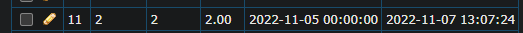
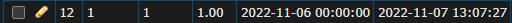

## Api information


|    Обозначение |                Описание                 |
|---------------:|:---------------------------------------:|
|    HTTP Method |           GET/ POST / DELETE            |
|        API URL | **http://tmbackendtrainee.test/api/v1** |
|       Response format |                **JSON**                 |

### Statistics list

|   Name |    Param     | Value  | Description                  |
|-------:|:------------:|:-------|:-----------------------------|
|   from |    [from]    | date   | start date of the period (inclusive) |
|     to |     [to]     | date   | period end date (inclusive) |

#### Example:

**http://tmbackendtrainee.test/api/v1/statistics?from=2020-01-01&to=2022-01-01**

#### Form:

```html

<form action="http://tmbackendtrainee.test/api/v1/statistics" method="get">
    <input type="date" name="from">
    <input type="date" name="to">
    <input type="submit">
</form>
```

#### Response:

```php
{
    "statistics": [
        {
            "id": 3,
            "views": 327,
            "clicks": 99,
            "cost": "51 руб 8коп.",
            "created_at": "2021-01-22T00:00:00.000000Z",
            "updated_at": "1970-04-15T00:00:00.000000Z",
            "cpc": "0 руб 52коп.",
            "cpm": "158 руб 41коп."
        },
        {
            "id": 10,
            "views": 170,
            "clicks": 916,
            "cost": "81 руб 31коп.",
            "created_at": "2020-11-24T00:00:00.000000Z",
            "updated_at": "1973-05-11T00:00:00.000000Z",
            "cpc": "0 руб 09коп.",
            "cpm": "478 руб 29коп."
        }
    ]
}
```

### Statistics save

|   Name |    Param     | Value      | Description                                     |
|-------:|:------------:|:-----------|:------------------------------------------------|
|   date |    [date]    | date       | start date of the period (inclusive)            |
|  views |   [views]    | bigInteger | number of impressions                                      |
| clicks |   [clicks]   | bigInteger | number of clicks                                   |
|   cost |    [cost]    | float      | cost of clicks (in rubles, accurate to kopecks) |


#### Example:

**http://tmbackendtrainee.test/api/v1/statistics?views=1&clicks=1&cost=1&date=2022-11-06**

#### Form:

```html

<form action="http://tmbackendtrainee.test/api/v1/statistics" method="post">
    <input type="number" name="clicks">
    <input type="number" name="views">
    <input type="number" name="cost">
    <input type="date" name="date">
    <input type="submit">
</form>
```

#### Response:

```php
{
    "id": 12
}
```

#### 2 requests for the same request to save statistics, statistics are stored in the same field if the date is the same.

#### request with a different date.

### Statistics restore

#### Example:

**http://tmbackendtrainee.test/api/v1/statistics**

#### Response:

```php
{
    "response": "statistics not found, nothing to clear."
}
```
will return if the database is empty.
```php
{
    "response": "Statistics clear"
}
```
will return if the database is full and cleared successfully

## Instructions for launching the application.

- Open console.
- Go to projects directory using in cd
- Clone the project git clone https://github.com/ktotopes/tmBackendTrainee.git
- Open to directory cd tmbackdendtrainee
- Run the command cp .env.example .env on LINUX or copy .env.example .env on WINDOWS
- Create the database
- Update .env file for connect to DB and correct variables
- Next run the command composer install
- When finished write php artisan key:generate
